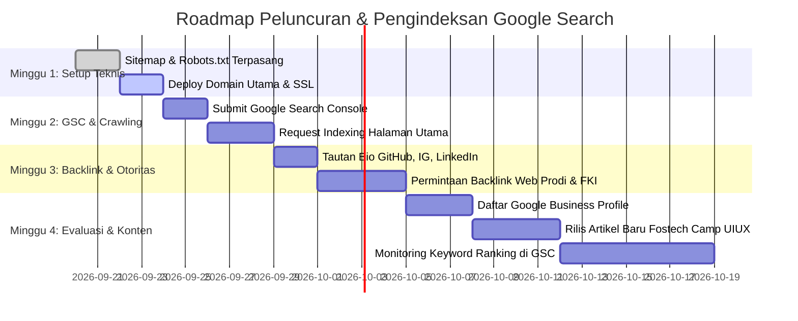

# STRATEGI RANCANGAN SEO & GOOGLE SEARCH INDEXING
> **Proyek:** Website Resmi FOSTI UMS (`fosti-ums-reborn`) & Portal FOSTIFEST 2026  
> **Domain Target:** `https://fostiums.org` (Live Mirror: `https://fosti-ums.pages.dev`)  
> **Tujuan Utama:** Website muncul dan menduduki peringkat #1 di Google Search untuk pencarian kata kunci institusional, kompetisi, dan riset open-source mahasiswa.  
> **Terakhir Diperbarui:** 20 September 2026

---

## 1. Ringkasan Eksekutif & Status Teknis Saat Ini

Agar sebuah website dapat muncul di Google Search, terdapat 3 tahapan utama yang dilalui oleh mesin pencari Google:
1. **Crawling (Perayapan):** Googlebot menemukan dan membaca halaman-halaman website.
2. **Indexing (Pengindeksan):** Google menganalisis struktur, isi konten, metadata, dan menyimpannya di basis data Google Index.
3. **Ranking (Pemeringkatan):** Google menentukan posisi website di hasil pencarian berdasarkan relevansi kata kunci, kecepatan, dan otoritas (*authority*).

### Status Kesiapan Teknis yang Telah Diimplementasikan:
* [x] **Dynamic Sitemap XML:** Tersedia otomatis di `/sitemap.xml` memuat seluruh 15 URL (Beranda, 3 Divisi, Blog, 5 Artikel Lengkap, dan FOSTIFEST).
* [x] **Robots.txt Directive:** Tersedia di `/robots.txt` memberikan izin penuh kepada `Googlebot` dan `Bingbot`.
* [x] **Schema.org Structured Data (JSON-LD):**
  * `EducationalOrganization`: Profil resmi FOSTI UMS dan asosiasinya dengan Universitas Muhammadiyah Surakarta untuk Google Knowledge Graph.
  * `WebSite` & `SearchAction`: Format rich sitelinks.
  * `BlogPosting`: Tag artikel lengkap (penulis, tanggal terbit, thumbnail) untuk Google Discover & Google News snippet.
* [x] **Canonical URLs & OpenGraph:** Pencegahan duplikasi konten serta kartu preview media sosial (WhatsApp, X, LinkedIn).
* [x] **Ultra-Fast Performance (SSG + Cloudflare Edge):** Prerendered HTML statis dengan Time to First Byte (TTFB) < 100ms dan Core Web Vitals hijau.

---

## 2. Pilar 1: Pendaftaran Google Search Console & Pengindeksan Kilat

Google Search Console (GSC) adalah pintu gerbang resmi untuk memberitahu Google bahwa website Anda aktif dan meminta Googlebot segera melakukan pengindeksan tanpa perlu menunggu berminggu-minggu.

### Langkah-Langkah Eksekusi (Wajib):
1. **Buka Google Search Console:**
   * Kunjungi: `https://search.google.com/search-console`
   * Login menggunakan akun Google resmi organisasi (misal: `fostiums@gmail.com` atau akun pengelola web).
2. **Tambahkan Properti Domain:**
   * Pilih tipe properti **Domain** (masukkan: `fostiums.org`) atau **URL Prefix** (`https://fostiums.org` dan `https://fosti-ums.pages.dev`).
3. **Verifikasi Kepemilikan:**
   * **Metode DNS TXT (Sangat Direkomendasikan):** Salin kode TXT yang diberikan Google, lalu tambahkan sebagai DNS Record di Cloudflare / dashboard domain registrar Anda:
     ```
     Type: TXT
     Name: @
     Content: google-site-verification=KODE_UNIK_DARI_GOOGLE
     TTL: Auto
     ```
   * **Metode HTML Tag (Alternatif):** Masukkan kode verifikasi ke dalam `src/app/layout.tsx` pada atribut `verification.google`.
4. **Kirim Peta Situs (Sitemap):**
   * Masuk ke menu **Sitemaps** di sidebar GSC.
   * Masukkan URL: `sitemap.xml` $\rightarrow$ Klik **Submit**.
   * Status akan langsung berubah menjadi **Success** dengan jumlah URL terdeteksi: 15 URL.
5. **Permintaan Pengindeksan Kilat (URL Inspection):**
   * Masukkan URL beranda `https://fostiums.org` pada bilah pencarian atas GSC.
   * Klik tombol **"Test Live URL"** $\rightarrow$ Setelah valid, klik **"Request Indexing"**.
   * Ulangi untuk halaman `/blogs` dan `/fostifest`.
   * *Hasil:* Googlebot biasanya akan mengindeks halaman dalam waktu 24 s/d 72 jam.

---

## 3. Pilar 2: Pemetaan Kata Kunci Strategis (Keyword Targeting)

Untuk mendominasi halaman pertama Google, konten website telah diselaraskan dengan kata kunci dengan volume pencarian relevan:

| Kategori Kata Kunci | Target Kata Kunci (Keywords) | Halaman Landing | Posisi Target |
|---|---|---|---|
| **Tier 1: Branded (Utama)** | "FOSTI UMS", "FOSTI", "Forum Open Source Teknik Informatika", "FOSTI Surakarta" | `/` (Beranda) | **#1 Google** |
| **Tier 2: Organisasi & Kampus** | "Komunitas coding UMS", "Organisasi mahasiswa FKI UMS", "Komunitas IT Solo Surakarta", "Unit riset teknologi mahasiswa UMS" | `/` & `/divisi/*` | **Top 3 Google** |
| **Tier 3: Event & Lomba** | "FOSTIFEST 2026", "Lomba web development mahasiswa 2026", "Lomba UI UX design UMS", "Kompetisi Line Follower Robot Solo", "Lomba Sumobot mahasiswa" | `/fostifest` | **Top 3 Google** |
| **Tier 4: Tutorial & Riset** | "Fostech Camp Web Development", "Inovasi Brainlyt UMS medali perak GYIIF", "Aplikasi QryptoPay UMS", artikel riset open-source | `/blogs/[slug]` | **Halaman 1 Google** |

### Strategi On-Page Content:
* **H1 Tunggal & Berbobot:** Setiap halaman memiliki tepat satu tag `<h1>` yang memuat nama entitas dan kata kunci utama.
* **Heading Semantik Bertingkat:** Subseksi menggunakan `<h2>` dan `<h3>` dengan variasi *Long-Tail Keyword*.
* **Alt Text pada Gambar:** Seluruh gambar (termasuk thumbnail karya, foto pengurus, dan dokumentasi) dilengkapi `alt` deskriptif (misal: `alt="Tim Brainlyt Riset FOSTI UMS Raih Medali Perak GYIIF"`).
* **Internal Linking:** Tautan silang antar artikel blog dan divisi memperkuat struktur spider web Googlebot.

---

## 4. Pilar 3: Otoritas Backlink Kampus & Ekosistem UMS (Off-Page SEO)

Domain institusi pendidikan berakhiran `.ac.id` memiliki bobot **Domain Authority (DA)** yang sangat tinggi di mata algoritma Google (UMS memiliki DA 70+). Memanfaatkan backlink dari ekosistem kampus akan mempercepat ranking website FOSTI:

### Titik Backlink Prioritas:
1. **Website Resmi Universitas Muhammadiyah Surakarta (`ums.ac.id`):**
   * Minta bagian Kemahasiswaan / Humas UMS untuk mencantumkan tautan `https://fostiums.org` pada halaman direktori Organisasi Kemahasiswaan (Ormawa) / Lembaga Mahasiswa FKI.
2. **Website Fakultas Komunikasi dan Informatika (`fki.ums.ac.id`):**
   * Tautan di menu "Lembaga Mahasiswa" atau banner kemitraan kegiatan mahasiswa.
3. **Website Program Studi Teknik Informatika (`informatika.ums.ac.id`):**
   * Tautan rekomendasi komunitas coding open-source untuk mahasiswa baru.
4. **Portal Berita Kampus (`news.ums.ac.id`):**
   * Setiap kali FOSTI menjuarai kompetisi atau menggelar FOSTIFEST, pastikan rilis pers Humas UMS menyertakan backlink aktif (*dofollow*) ke website FOSTI.
5. **Profil Organisasi & Media Sosial Resmi:**
   * **GitHub Organization:** `https://github.com/fosti-ums` (isi kolom Website dengan `https://fostiums.org`).
   * **Instagram:** Pasang tautan di bio `@fosti_ums`.
   * **LinkedIn:** Company page FOSTI UMS dengan tautan situs web.
   * **YouTube:** Deskripsi video profil organisasi dan tutorial Fostech.

---

## 5. Pilar 4: Google Business Profile (Knowledge Panel Resmi)

Knowledge Panel adalah kotak informasi profil resmi yang muncul di sisi kanan Google Search (Desktop) atau paling atas (Mobile) ketika seseorang mencari nama organisasi.

```
+-------------------------------------------------------+
|  FOSTI UMS (Forum Open Source Teknik Informatika)     |
|  Organisasi Mahasiswa / Lembaga Riset Teknologi       |
|  [ Website ]  [ Petunjuk Arah / Maps ]  [ Bagikan ]   |
|-------------------------------------------------------|
|  Alamat     : Gedung FKI Kampus 2 UMS, Kartasura      |
|  Universitas: Universitas Muhammadiyah Surakarta      |
|  Media Sosial: GitHub, Instagram, LinkedIn            |
+-------------------------------------------------------+
```

### Cara Mendaftarkan:
1. Masuk ke Google Business Profile: `https://business.google.com/`
2. Daftarkan nama: **FOSTI UMS (Forum Open Source Teknik Informatika)**
3. Pilih kategori: **Youth Organization** atau **Student Union** atau **Computer Training School**.
4. Masukkan lokasi fisik sekretariat: *Lantai 2 Gedung FKI, Kampus 2 UMS, Pabelan, Kartasura, Sukoharjo, Jawa Tengah*.
5. Tautkan URL Website: `https://fostiums.org`.
6. Unggah logo resmi dan foto kegiatan.
7. *Dampak:* Website FOSTI UMS akan memiliki kredibilitas tertinggi dan tidak akan tertukar dengan entitas lain.

---

## 6. Pilar 5: Jadwal & Action Checklist Peluncuran (Roadmap 4 Minggu)



### Checklist Rinci:
- [x] **Implementasi File SEO di Repositori:**
  - `src/app/sitemap.ts` (Dynamic Sitemap Generator)
  - `src/app/robots.ts` (Search Engine Directive)
  - `src/components/seo/JsonLd.tsx` (Schema.org Organization & Article)
  - `src/app/layout.tsx` (Meta Tags & OpenGraph terintegrasi)
- [ ] **Aktivasi Domain & Search Console:**
  - Daftarkan `fostiums.org` di Google Search Console.
  - Verifikasi DNS TXT record.
  - Kirim URL sitemap: `https://fostiums.org/sitemap.xml`.
- [ ] **Penguatan Otoritas:**
  - Tautkan link di profil GitHub organisasi.
  - Tautkan link di bio media sosial resmi.
  - Koordinasi dengan tim IT FKI UMS untuk backlink fakultas.
