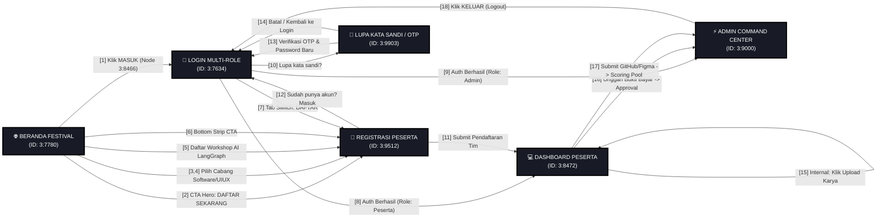

# WIREFRAME ARCHITECTURE & INTERCONNECTION MAP // PROYEK UTILITE
> **Proyek:** Utilite — Ekosistem Web FOSTI UMS & Portal FOSTIFEST 2026  
> **Figma File URL:** `https://www.figma.com/design/EbkFFZo4EDtNf8cAIMiXU1/Untitled?node-id=3-8466`  
> **Target Node Utama:** Node `3:8466` (Tombol "MASUK" pada Header Beranda Festival)  
> **Desain Standar:** Lego Neo-Brutalism (Solid 2–4px Black Borders, Hard Offset Shadows, Courier / JetBrains Mono Typography)  
> **Terakhir Diperbarui:** 19 September 2026

---

## 1. Ringkasan Eksekutif & Struktur Canvas Figma

Berdasarkan inspeksi langsung terhadap berkas Figma `EbkFFZo4EDtNf8cAIMiXU1` milik akun **Farid** (`faridmarufprabowo2021@gmail.com`), seluruh halaman wireframe tersusun sejajar secara horizontal pada koordinat `y = -2152` dengan lebar masing-masing `1280px` dan gap reguler `32px`.

### Daftar Screen / Frame Utama pada Canvas Figma:

| No | Nama Frame di Figma | Node ID | Dimensi (W x H) | Koordinat (X, Y) | Target Endpoint / Route | Screenshot Lokal |
|---|---|---|---|---|---|---|
| **01** | **Login & Registrasi Multi-Role** | `3:7634` | 1280 × 1024 px | `x: 5902, y: -2152` | `/fostifest/login` | [`login_multi_role.png`](file:///C:/Users/PERSONAL/Downloads/fostifest-design/frames/login_multi_role.png) |
| **02** | **Beranda Festival FOSTIFEST 2025** | `3:7780` | 1280 × 4111 px | `x: 7214, y: -2152` | `/fostifest` | [`beranda_festival.png`](file:///C:/Users/PERSONAL/Downloads/fostifest-design/frames/beranda_festival.png) |
| **03** | **Dashboard Peserta FOSTIFEST** | `3:8472` | 1280 × 2206 px | `x: 8526, y: -2152` | `/fostifest/dashboard` | [`dashboard_peserta.png`](file:///C:/Users/PERSONAL/Downloads/fostifest-design/frames/dashboard_peserta.png) |
| **04** | **Admin Command Center FOSTIFEST** | `3:9000` | 1280 × 1292 px | `x: 9838, y: -2152` | `/fostifest/admin` | [`admin_command_center.png`](file:///C:/Users/PERSONAL/Downloads/fostifest-design/frames/admin_command_center.png) |
| **05** | **Registrasi Peserta FOSTIFEST 2025** | `3:9512` | 1280 × 1937 px | `x: 11150, y: -2152` | `/fostifest/register` | [`registrasi_peserta.png`](file:///C:/Users/PERSONAL/Downloads/fostifest-design/frames/registrasi_peserta.png) |
| **06** | **Lupa Kata Sandi FOSTIFEST 2025** | `3:9903` | 1280 × 1146.5 px | `x: 12462, y: -2152` | `/fostifest/forgot-password` | [`lupa_kata_sandi.png`](file:///C:/Users/PERSONAL/Downloads/fostifest-design/frames/lupa_kata_sandi.png) |

---

## 2. Inspeksi Mendalam Titik Referensi: Node `3:8466`

Node yang tercantum dalam link pengguna (`node-id=3-8466`) merupakan komponen interaktif krusial:
- **Tipe:** `FRAME` (Komponen Link / Tombol Taktil)
- **Nama Komponen:** `Link`
- **Teks:** `"MASUK"` (ID `3:8468`, font `JetBrains Mono Bold 12px UPPERCASE`)
- **Posisi Absolut:** `x: 8356.09, y: -2126` (di dalam Header Beranda `3:8434`)
- **Visual Styling:**
  - Background Fill: Solid Lego Red `#EF4444` (`rgb(0.937, 0.267, 0.267)`)
  - Border/Stroke: Solid Black 2px (`#000000`)
  - Drop Shadow: Hard Offset `3px 3px 0px #000000` (Zero Blur Radius)
- **Fungsi Interaksi:** Jalur koneksi primer pengguna dari **Beranda Festival FOSTIFEST** langsung menuju **Halaman Login Multi-Role (`3:7634`)**.

---

## 3. Matriks Interkoneksi Garis Wireframe (18 Jalur Antar Halaman & Seksi)

Tabel berikut adalah acuan presisi garis penghubung wireframe (Wireflow) yang menghubungkan trigger pada komponen sumber ke komponen/seksi target:

| No | Kode Jalur | Komponen Sumber (Node ID) | Layar Sumber | Komponen / Seksi Target (Node ID) | Layar Target | Tipe Pemicu (Trigger) | Warna Garis & Kode Estetika |
|---|---|---|---|---|---|---|---|
| **1** | `WF-01` | **Tombol "MASUK"** (`3:8466`) | Beranda Festival | **Form Login** (`3:7699`) | Login Multi-Role (`3:7634`) | User klik tombol login di header kanan atas | 🔴 **Lego Red** (`#EF4444`) - Tebal 3.5px |
| **2** | `WF-02` | **Tombol "DAFTAR SEKARANG" Hero** (`3:8166`) | Beranda Festival | **Top Hero & Form Stepper** (`3:9515`) | Registrasi Peserta (`3:9512`) | User klik CTA utama di Hero Section | 🔵 **Lego Blue** (`#2563EB`) - Tebal 3.5px |
| **3** | `WF-03` | **Card Bento: Software Dev** (`3:7909`) | Beranda Festival | **Bento Pilihan Cabang Lomba** (`3:9690`) | Registrasi Peserta (`3:9512`) | User klik kartu cabang lomba (Software Dev) | 🔵 **Lego Blue** (`#2563EB`) - Tebal 2.5px |
| **4** | `WF-04` | **Card Bento: UI/UX Design** (`3:7951`) | Beranda Festival | **Bento Pilihan Cabang Lomba** (`3:9690`) | Registrasi Peserta (`3:9512`) | User klik kartu cabang lomba (UI/UX) | 🔵 **Lego Blue** (`#2563EB`) - Tebal 2.5px |
| **5** | `WF-05` | **Tombol "DAFTAR WORKSHOP"** (`3:8273`) | Beranda Festival | **Bento Pilihan Cabang (Workshop AI)** (`3:9690`) | Registrasi Peserta (`3:9512`) | User mendaftar ke Workshop LangGraph AI | 🟡 **Lego Amber** (`#F59E0B`) - Tebal 3px |
| **6** | `WF-06` | **Tombol "DAFTAR SEKARANG" Strip** (`3:8386`) | Beranda Festival | **Form Pendaftaran Akun** (`3:9515`) | Registrasi Peserta (`3:9512`) | User klik banner CTA di footer landing page | 🔵 **Lego Blue** (`#2563EB`) - Tebal 3px |
| **7** | `WF-07` | **Tab "DAFTAR" Switcher** (`3:7689`) | Login Multi-Role | **Formulir Pendaftaran Tim** (`3:9515`) | Registrasi Peserta (`3:9512`) | User beralih mode dari tab login ke registrasi | 🔵 **Lego Blue** (`#2563EB`) - Tebal 3px |
| **8** | `WF-08` | **Tombol "MASUK KE DASHBOARD ->"** (`3:7724`) | Login Multi-Role | **Header Profil & Stat Bento** (`3:8487`) | Dashboard Peserta (`3:8472`) | Login berhasil dengan kredensial Peserta | 🟢 **Lego Green** (`#10B981`) - Tebal 4px |
| **9** | `WF-09` | **Tombol "MASUK KE DASHBOARD ->"** (`3:7724`) | Login Multi-Role | **Cockpit KPI Real-Time Deck** (`3:9021`) | Admin Command Center (`3:9000`) | Login berhasil dengan kredensial Admin / Panitia | 🟣 **Lego Purple** (`#8B5CF6`) - Tebal 3.5px |
| **10** | `WF-10` | **Link "Lupa kata sandi?"** (`3:7724`) | Login Multi-Role | **Step 1: Dispatch OTP WhatsApp** (`3:9929`) | Lupa Kata Sandi (`3:9903`) | User lupa kredensial login akunnya | 🟡 **Lego Amber** (`#F59E0B`) - Tebal 3px |
| **11** | `WF-11` | **Tombol "DAFTAR SEKARANG & BUAT AKUN"** (`3:9856`) | Registrasi Peserta | **Seksi 5: Billing & Pembayaran** (`3:8814`) | Dashboard Peserta (`3:8472`) | Form submit sukses, akun tim dibuat otomatis | 🟢 **Lego Green** (`#10B981`) - Tebal 3.5px |
| **12** | `WF-12` | **Link "Sudah punya akun? Masuk di sini"** (`3:9854`) | Registrasi Peserta | **Form Login Multi-Role** (`3:7699`) | Login Multi-Role (`3:7634`) | User membatalkan reg & ingin login manual | 🔴 **Lego Red** (`#EF4444`) - Tebal 2.5px |
| **13** | `WF-13` | **Tombol "SIMPAN KATA SANDI BARU & MASUK"** (`3:10044`) | Lupa Kata Sandi | **Form Login (Pesan Notifikasi Sukses)** (`3:7699`) | Login Multi-Role (`3:7634`) | OTP 6-digit terverifikasi & sandi diubah | 🔴 **Lego Red** (`#EF4444`) - Tebal 3px |
| **14** | `WF-14` | **Link "KEMBALI KE HALAMAN MASUK AKUN"** (`3:10095`) | Lupa Kata Sandi | **Form Login** (`3:7699`) | Login Multi-Role (`3:7634`) | User batal reset dan kembali ke login | 🔴 **Lego Red** (`#EF4444`) - Tebal 2px |
| **15** | `WF-15` | **Tombol "Upload Karya / Proposal"** (`3:8656`) | Dashboard Peserta | **SECTION 4: SUBMISSION HUB FORM** (`3:8714`) | Dashboard Peserta (Internal) | Klik tombol pada card kompetisi aktif | 💠 **Lego Cyan** (`#06B6D4`) - Tebal 3px |
| **16** | `WF-16` | **Tombol "KONFIRMASI PEMBAYARAN"** (`3:8922`) | Dashboard Peserta | **High-Density Table: Tab Pembayaran** (`3:9151`) | Admin Command Center (`3:9000`) | Peserta unggah bukti bayar transfer bank | 🟡 **Lego Amber** (`#F59E0B`) - Tebal 3px |
| **17** | `WF-17` | **Tombol "SIMPAN & KIRIM KARYA AKHIR"** (`3:8807`) | Dashboard Peserta | **Tab SUBMISSION KARYA & Assign Juri** (`3:9091`) | Admin Command Center (`3:9000`) | Peserta submit link GitHub & Figma | 🟣 **Lego Purple** (`#8B5CF6`) - Tebal 3px |
| **18** | `WF-18` | **Link "KELUAR" Header Nav** (`3:9471` & `3:8959`) | Admin & Peserta | **Form Login Multi-Role** (`3:7634`) | Login Multi-Role (`3:7634`) | User klik tombol logout sesi kerja | 🔴 **Lego Red** (`#EF4444`) - Tebal 2.5px |

---

## 4. Diagram Visual Alur Antar Layar (Mermaid Flowchart)

---

## 5. Cara Menggambar Garis Wireframe Otomatis di Figma

Kami telah menyediakan plugin otomatis siap pakai agar Anda dapat langsung merender garis-garis konektor ini di dalam canvas Figma Anda:

### Lokasi Berkas Plugin:
1. Manifest: [`C:\Users\PERSONAL\Downloads\fostifest-design\figma-plugin-wireframe\manifest.json`](file:///C:/Users/PERSONAL/Downloads/fostifest-design/figma-plugin-wireframe/manifest.json)
2. Script Kode: [`C:\Users\PERSONAL\Downloads\fostifest-design\figma-plugin-wireframe\code.js`](file:///C:/Users/PERSONAL/Downloads/fostifest-design/figma-plugin-wireframe/code.js)

### Langkah-langkah Menjalankan di Figma Web / Desktop:
1. Buka berkas Anda: `https://www.figma.com/design/EbkFFZo4EDtNf8cAIMiXU1/Untitled?node-id=3-8466`
2. Klik kanan di sembarang area canvas Figma.
3. Pilih menu **Plugins** > **Development** > **Import plugin from manifest...**.
4. Pilih berkas [`manifest.json`](file:///C:/Users/PERSONAL/Downloads/fostifest-design/figma-plugin-wireframe/manifest.json) yang berada di folder Downloads.
5. Klik **Run**.
6. **Selesai!** Figma akan seketika menggambar seluruh 18 garis koneksi dengan panah terarah, label keterangan teks, dan warna terstandarisasi yang dikelompokkan ke dalam layer `"⚡ WIREFRAME FLOW CONNECTORS (UTILITE / FOSTIFEST 2026)"`.

---

## 6. Aplikasi Visual Interaktif Canvas (Standalone Web App)

Untuk memeriksa wireflow ini secara visual tanpa membuka Figma, Anda dapat langsung membuka aplikasi HTML interaktif yang telah kami rakit:

- **Lokasi File:** [`C:\Users\PERSONAL\Downloads\fostifest-design\wireflow_utilite.html`](file:///C:/Users/PERSONAL/Downloads/fostifest-design/wireflow_utilite.html) atau [`C:\Users\PERSONAL\Downloads\wireflow_utilite.html`](file:///C:/Users/PERSONAL/Downloads/wireflow_utilite.html)
- **Fitur Interaktif:**
  - Menampilkan miniatur 6 frame beresolusi tinggi langsung dari render Figma.
  - Garis kurva SVG dinamis dengan animasi aliran energi dan titik pulsa.
  - Klik pada tombol hotspot apa pun (seperti tombol "MASUK" `3:8466`, "DAFTAR SEKARANG", dll.) untuk menyorot jalur garis yang sesuai.
  - Filter kategori: *Semua Garis*, *Autentikasi*, *Pendaftaran*, *Peserta & Upload*, *Recovery OTP*, *Admin & Juri*.
  - Dilengkapi kontrol Pan (geser) dan Zoom (perbesar/perkecil) yang mulus.
