# WIREFRAME ARCHITECTURE MAP // PROYEK UTILITE
> **Proyek:** Utilite — Ekosistem Web FOSTI UMS & Portal FOSTIFEST 2025  
> **Status Token Figma:** Terhubung (`Farid - faridmarufprabowo2021@gmail.com`)  
> **Pendekatan:** Lego Neo-Brutalism Flow & Section Connectivity

---

## 1. Diagram Alur Wireframe Antar Halaman & Seksi (Mermaid Visual Map)

Diagram di bawah ini menggambarkan koneksi struktural dan alur navigasi pengguna di seluruh halaman dan seksi:

```mermaid
flowchart TD
    %% Global Styling
    classDef mainSite fill:#18181b,stroke:#e4e4e7,stroke-width:2px,color:#fff;
    classDef festSite fill:#09090b,stroke:#0055A4,stroke-width:2px,color:#fff;
    classDef authSite fill:#09090b,stroke:#AF101A,stroke-width:2px,color:#fff;
    classDef dashSite fill:#12141a,stroke:#FFD700,stroke-width:2px,color:#fff;
    classDef sectionNode fill:#27272a,stroke:#71717a,stroke-width:1px,color:#e4e4e7;

    %% 1. ROOT HOME
    HOME["🌐 ROOT HOME: /<br/>(Portal Utama FOSTI UMS)"]:::mainSite
    
    %% Sections of Home
    H_NAV["Navbar Taktil & Theme Switch"]:::sectionNode
    H_HERO["Hero 3D Kinetic & Decrypted Title"]:::sectionNode
    H_ABOUT["About Section (Nilai 2008)"]:::sectionNode
    H_DIV["Divisions Bento Grid"]:::sectionNode
    H_MEM["Pengurus Showcase & 3D Lanyard Modal"]:::sectionNode
    H_ACH["Achievements & Medali Internasional"]:::sectionNode
    H_GAL["Galeri Masonry Cloudinary"]:::sectionNode
    H_TERM["Interactive Hacker Terminal CLI"]:::sectionNode
    H_OPREC["Oprec CTA Banner"]:::sectionNode
    H_FOOTER["Footer & Social Directory"]:::sectionNode

    HOME --> H_NAV
    HOME --> H_HERO
    HOME --> H_ABOUT
    HOME --> H_DIV
    HOME --> H_MEM
    HOME --> H_ACH
    HOME --> H_GAL
    HOME --> H_TERM
    HOME --> H_OPREC
    HOME --> H_FOOTER

    %% 2. DIVISION PAGES
    DIV_RISTEK["📁 /divisi/ristek<br/>(Riset & Teknologi)"]:::mainSite
    DIV_KEOR["📁 /divisi/keor<br/>(Keorganisasian)"]:::mainSite
    DIV_HUBPUB["📁 /divisi/hubpub<br/>(Hubungan Publik)"]:::mainSite

    H_DIV -->|Klik Kartu Biru| DIV_RISTEK
    H_DIV -->|Klik Kartu Merah| DIV_KEOR
    H_DIV -->|Klik Kartu Kuning| DIV_HUBPUB

    %% 3. BLOG HUB
    BLOG_INDEX["📰 /blogs<br/>(Indeks Artikel & Search)"]:::mainSite
    BLOG_DETAIL["📄 /blogs/[slug]<br/>(Reader View & Detail Riset)"]:::mainSite

    H_NAV -->|Nav Link Blog| BLOG_INDEX
    H_HERO -->|CTA Baca Riset| BLOG_INDEX
    BLOG_INDEX -->|Pilih Artikel| BLOG_DETAIL

    %% 4. FOSTIFEST EVENT HUB
    FEST_HOME["🎪 /fostifest<br/>(Landing Page FOSTIFEST 2025)"]:::festSite
    FEST_HERO["Hero Festival & Countdown Timer"]:::sectionNode
    FEST_COMPS["4 Cabang Lomba (Bento Grid)"]:::sectionNode
    FEST_WRKSHP["AI Workshop: LangGraph"]:::sectionNode
    FEST_TIME["4-Phase Timeline Stepper"]:::sectionNode
    FEST_FAQ["FAQ Accordion (9 Pertanyaan)"]:::sectionNode
    FEST_HELPDESK["WhatsApp Direct Helpdesk"]:::sectionNode

    H_NAV -->|Badge Recruitment / Event| FEST_HOME
    H_OPREC -->|Banner Join Event| FEST_HOME

    FEST_HOME --> FEST_HERO
    FEST_HOME --> FEST_COMPS
    FEST_HOME --> FEST_WRKSHP
    FEST_HOME --> FEST_TIME
    FEST_HOME --> FEST_FAQ
    FEST_HOME --> FEST_HELPDESK

    %% 5. AUTH FLOW
    AUTH_LOGIN["🔐 /login<br/>(Login Multi-Role)"]:::authSite
    AUTH_REG["📝 /register<br/>(Registrasi Akun Peserta)"]:::authSite

    FEST_HERO -->|Tombol Masuk| AUTH_LOGIN
    FEST_HERO -->|Tombol Daftar| AUTH_REG
    FEST_COMPS -->|Klik Ikuti Lomba| AUTH_LOGIN
    AUTH_LOGIN <-->|Switch Login/Register| AUTH_REG

    %% 6. MULTI-ROLE DASHBOARDS
    DASH_USER["💻 /dashboard/peserta<br/>(Cockpit Peserta)"]:::dashSite
    DASH_ADMIN["⚡ /dashboard/admin<br/>(Command Center Panitia)"]:::dashSite
    DASH_JUDGE["⚖️ /dashboard/juri<br/>(Scoring Engine Dewan Juri)"]:::dashSite

    AUTH_LOGIN -->|Role: PARTICIPANT| DASH_USER
    AUTH_LOGIN -->|Role: ADMIN| DASH_ADMIN
    AUTH_LOGIN -->|Role: JUDGE| DASH_JUDGE
    AUTH_REG -->|Auto-login Setelah Sukses| DASH_USER

    %% Peserta Dashboard Sections
    U_LOMBA["My Competitions & Group WA"]:::sectionNode
    U_SUBMIT["Submission Hub (GitHub / Figma)"]:::sectionNode
    U_BILLING["Invoice & Upload Bukti Bayar"]:::sectionNode
    U_TM["Jadwal TM & Info Zoom"]:::sectionNode

    DASH_USER --> U_LOMBA
    DASH_USER --> U_SUBMIT
    DASH_USER --> U_BILLING
    DASH_USER --> U_TM

    %% Admin Dashboard Sections
    A_KPI["KPI Real-Time (142 Tim / Rp 8.4M)"]:::sectionNode
    A_VERIF["Verifikasi Bayar (Approve/Reject)"]:::sectionNode
    A_KURASI["Kurasi Karya & Asign Juri"]:::sectionNode
    A_EXPORT["Export Data Excel/CSV"]:::sectionNode

    DASH_ADMIN --> A_KPI
    DASH_ADMIN --> A_VERIF
    DASH_ADMIN --> A_KURASI
    DASH_ADMIN --> A_EXPORT

    %% Juri Dashboard Sections
    J_QUEUE["Antrean Karya Siap Dinilai"]:::sectionNode
    J_SHEET["Modal Penilaian Berbobot (0-100)"]:::sectionNode
    J_NOTES["Feedback Konstruktif & Ulasan"]:::sectionNode
    J_LEADER["Leaderboard Peringkat Juara"]:::sectionNode

    DASH_JUDGE --> J_QUEUE
    DASH_JUDGE --> J_SHEET
    DASH_JUDGE --> J_NOTES
    DASH_JUDGE --> J_LEADER

    %% Cross-interaction between Dashboards
    U_BILLING -.->|Data Pembayaran Masuk| A_VERIF
    U_SUBMIT -.->|Karya Terkirim| A_KURASI
    A_KURASI -.->|Tugaskan Penilaian| J_QUEUE
    J_SHEET -.->|Skor Selesai| J_LEADER
    J_LEADER -.->|Hasil Juara| H_ACH
```

---

## 2. Rincian Jalur Koneksi & Alur Pengguna (User Journey)

### Alur 1: Dari Beranda ke Divisi & Eksplorasi Pengurus
1. Pengunjung masuk ke `ROOT HOME (/)`.
2. Dari seksi **Divisions Bento**, pengguna mengklik salah satu kartu divisi:
   - Kartu Biru $\to$ Masuk ke `/divisi/ristek` (Fokus Web, AI, dan Proker FOSTECH Camp).
   - Kartu Merah $\to$ Masuk ke `/divisi/keor` (Fokus Tata Kelola, Makrab, dan Mubes).
   - Kartu Kuning $\to$ Masuk ke `/divisi/hubpub` (Fokus Media Kreatif dan Kemitraan).
3. Di dalam tiap halaman divisi atau seksi anggota di Beranda, klik tombol pengurus akan memicu **3D Lanyard Modal** (simulasi kartu ID interaktif).

### Alur 2: Dari Beranda ke Portal Riset & Artikel Blog
1. Dari **Navbar** atau tombol sekunder di **Hero Section**, pengguna mengklik *"Baca Riset & Blog"*.
2. Pengguna berpindah ke `/blogs` (Indeks Artikel) dengan fitur pencarian instan dan filter kategori.
3. Memilih salah satu artikel akan membuka `/blogs/[slug]` dengan format reader terfokus `max-w-4xl`.

### Alur 3: Pendaftaran Peserta FOSTIFEST (Lomba & Workshop)
1. Pengunjung mengakses `/fostifest` melalui badge pengumuman di Navbar atau banner Oprec.
2. Di seksi **Competitions Arena**, peserta memilih cabang lomba (misal: *Software Development* atau *UI/UX Design*).
3. Mengklik tombol *"Daftar Sekarang"* mengarahkan peserta ke `/register`.
4. Setelah mengisi formulir pendaftaran, akun terbuat dan peserta langsung diarahkan (*auto-redirect*) ke `/dashboard/peserta`.
5. Di Dashboard Peserta:
   - Peserta melihat rincian biaya pendaftaran dan rekening pembayaran.
   - Peserta mengunggah bukti transfer pada tab **Billing Hub**.
   - Menjelang tenggat waktu, peserta mengunggah link repositori GitHub / file Figma pada tab **Submission Hub**.
   - Peserta bergabung ke grup WhatsApp resmi lomba melalui tombol langsung.

### Alur 4: Alur Panitia & Dewan Juri
1. Panitia login di `/login` menggunakan akun Admin $\to$ diarahkan ke `/dashboard/admin`.
2. Admin melihat bukti pembayaran peserta yang masuk di **Tab Verifikasi**, lalu menekan tombol `Approve`.
3. Status pembayaran di Dashboard Peserta secara otomatis berubah menjadi `VERIFIED (LUNAS)`.
4. Dewan Juri login di `/login` menggunakan akun Juri $\to$ diarahkan ke `/dashboard/juri`.
5. Juri membuka antrean karya di **Evaluation Queue**, menguji prototype Figma atau kode GitHub, lalu mengisi nilai pada **Lembar Penilaian Berbobot** (skala 0 - 100).
6. Hasil penilaian otomatis memperbarui **Leaderboard Juara** secara *real-time*.

---

## 3. Spesifikasi Wireframe Grid & Dimensi Komponen

| Komponen Wireframe | Dimensi Grid Desktop | Dimensi Grid Mobile | Tipe Border & Shadow |
|:---|:---|:---|:---|
| **Navbar Taktil** | `max-w-7xl`, `h-16`, flex row | `w-full`, `h-14`, sticky top | Border 2px solid, shadow-sm |
| **Hero Split Screen** | 12-kolom (`col-span-7` + `col-span-5`) | 1-kolom bertingkat (`col-span-12`) | Border 2px solid, shadow-lg |
| **Bento Grid Divisi / Lomba** | 3-kolom asimetris (`1.2fr 1fr 1fr`) | 1-kolom vertikal penuh | Border 2px solid, shadow 4px |
| **Kartu Pengurus / Juri** | 4-kolom (`grid-cols-4`, gap 6) | 1 atau 2-kolom (`grid-cols-2`) | Border 2px solid, shadow 4px |
| **Dashboard Bento Metrik** | 3 atau 4 kartu KPI horizontal | 2x2 grid pada layar sentuh | Border 2px solid, shadow 4px |
| **Tabel Admin & Juri** | Tampilan tabel lebar dengan sticky header | Kartu responsif list view | Border 2px solid, zebra row |
